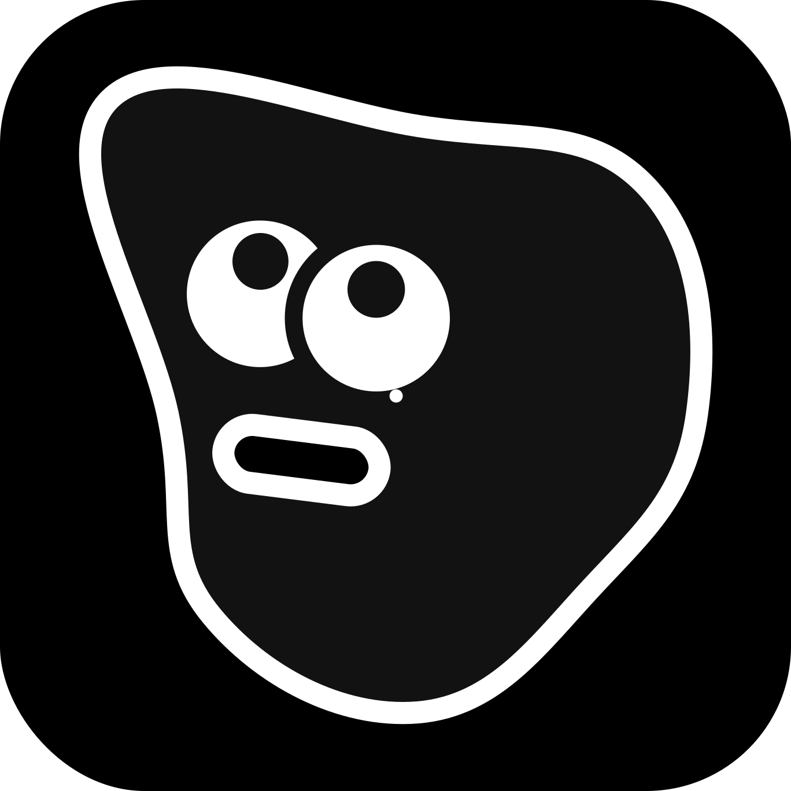

<div align="center">
  <a href="https://kuku.mom">
    <picture>
      <source media="(prefers-color-scheme: dark)" srcset="assets/logo/logo.svg">
      <source media="(prefers-color-scheme: light)" srcset="assets/logo/logo.svg">
      
    </picture>
  </a>

  <h1 align="center">Kuku</h1>

  <p align="center">
    <strong>macOS를 위한 로컬 우선 Markdown 지식 작업공간.</strong><br>
    일반 파일, 개인 위키, Second Brain 워크플로, AI diff, 암호화 동기화.
  </p>

  <p align="center">
    <a href="https://github.com/kuku-mom/kuku/blob/main/LICENSE"></a>
    <a href="https://github.com/kuku-mom/kuku/releases"></a>
    <a href="https://github.com/kuku-mom/kuku"></a>
    <a href="https://deepwiki.com/kuku-mom/kuku"></a>
    
    
  </p>

  <p align="center">
    <a href="https://kuku.mom"><strong>Website</strong></a> ·
    <a href="https://github.com/kuku-mom/kuku/releases"><strong>Download</strong></a> ·
    <a href="https://deepwiki.com/kuku-mom/kuku"><strong>DeepWiki</strong></a> ·
    <a href="https://kuku.mom/changelog"><strong>Changelog</strong></a> ·
    <a href="https://kuku.mom/roadmap"><strong>Roadmap</strong></a> ·
    <a href="README.md"><strong>English</strong></a>
  </p>

  <p align="center">
    <a href="https://kuku.mom">
      
    </a>
  </p>
</div>

<p align="center">
  ⭐ <em>Kuku가 유용하거나 흥미롭다면 GitHub star로 프로젝트가 더 많은 사람에게 닿도록 도와주세요.</em>
</p>

## Kuku

Kuku는 평범한 `.md` 파일 위에서 글을 쓰고, 연결하고, 검색하고, 동기화하고, AI와 함께 정리할 수 있는 오픈소스 Markdown 앱입니다. 노트는 내 컴퓨터의 폴더에 남고, 필요할 때만 계정, AI, 동기화를 선택해서 붙일 수 있습니다.

## 왜 Kuku인가?

Notion은 편하지만 데이터가 플랫폼 안에 갇힙니다. Obsidian은 강력하지만 Electron 기반이고, AI가 실제 파일을 조심스럽게 편집하는 경험은 아직 부족합니다.

Kuku는 다른 선택지를 목표로 합니다.

- **Plain Markdown**: 모든 노트는 일반 `.md` 파일입니다.
- **Local-first**: 먼저 로컬에서 동작하고, 클라우드는 선택 사항입니다.
- **Native macOS**: Tauri + SolidJS로 만든 가벼운 데스크톱 앱입니다.
- **AI-native editing**: AI가 지식보관함을 검색하고, 파일을 읽고, 검토 가능한 변경을 제안합니다.
- **Self-improving knowledge**: 결정 문서를 통해 AI 제안을 오래 남는 memory와 wiki 업데이트로 전환합니다.
- **No lock-in**: vim, git, Obsidian, 다른 Markdown 도구와 함께 쓸 수 있습니다.

Kuku가 향하는 더 긴 방향은 완전한 사용자 통제권입니다. 투명한 코드, 살펴볼 수 있는 인프라, 그리고 Kuku를 호스팅 서비스로 쓰든, 직접 서버를 돌리든, 이미 신뢰하는 서비스를 연결하든 사용자가 선택할 수 있는 자유를 목표로 합니다.

## 현재 동작하는 것

Kuku는 현재 macOS 데스크톱 앱과 계정, AI, 동기화를 뒷받침하는 셀프 호스팅 가능한 서버 스택에 집중하고 있습니다.

### 로컬 Markdown 작업공간

- 로컬 지식보관함 폴더를 열고 일반 `.md` 파일을 직접 편집합니다.
- SolidJS + ProseMirror 에디터로 자동 저장, 서식 명령, 테마, 타이포그래피, 단축키를 제공합니다.
- 파일은 git, vim, Obsidian, 다른 Markdown 도구와 함께 쓸 수 있도록 그대로 유지됩니다.

### 링크, 검색, 그래프

- `[[위키링크]]`, 백링크, 그래프 탐색으로 개인 위키를 만듭니다.
- Rust 인덱서가 Markdown 본문, 위키링크 대상, 그래프 데이터를 색인합니다.
- 빠른 검색, 고급 검색, 백링크 기반 그래프, 2D / 3D 그래프 모드, 클러스터, 미연결 노트 탐색, 지식보관함 통계를 제공합니다.

### Second Brain과 결정 문서

- Second Brain 패널에서 지식보관함 안의 memory, wiki page, proposal, decision을 관리합니다.
- AI가 오래 남길 memory나 wiki 업데이트를 제안하면, Markdown 결정 문서로 먼저 검토한 뒤 적용합니다.
- 제안된 지식 변경을 수락, 거절, 수정하면서 숨은 자동화가 아니라 명시적인 결정으로 시스템을 개선합니다.
- 저장된 memory와 wiki page를 검색하고, 이후 AI 대화의 맥락으로 다시 가져옵니다.
- 모든 결정, 제안, 적용된 memory의 흔적은 일반 Markdown으로 추적할 수 있습니다.

### 지식보관함과 함께 일하는 AI

- 오른쪽 패널에서 Agent / Ask / Inline 모드를 사용할 수 있습니다.
- 파일이나 선택한 텍스트를 컨텍스트로 첨부합니다.
- AI에게 노트 검색, 요약, 교정, 번역, 문장 다듬기, 링크 제안, 편집 제안, Second Brain 지식 업데이트를 요청할 수 있습니다.
- AI 편집은 바로 적용하지 않고 approval과 diff 흐름으로 검토합니다.
- Kuku Remote 로그인으로 연결하거나, 로컬에 Gemini API 키를 설정할 수 있습니다.

### 암호화 동기화 기반

- 지식보관함별로 워크스페이스, 기기, 패스프레이즈 기반 암호화 동기화를 설정합니다.
- 기기 등록, 암호화된 key envelope, 서명된 commit 게시, 암호화 object 전송, 불투명한 서버 메타데이터를 다룹니다.
- 충돌 복사본은 일반 Markdown 파일로 남겨 지식보관함을 계속 살펴볼 수 있게 합니다.
- 제공되는 Docker 인프라로 동기화 서버를 로컬에서 실행하거나 배포할 수 있습니다.

### 웹과 서버

- 공개 사이트, 인증 페이지, 대시보드, 다운로드, 변경 기록, 로드맵을 위한 Astro 웹 앱.
- OAuth, 이메일 OTP, AI endpoint, sync API, migration, 프로덕션 Docker 이미지를 포함한 Go + Postgres API 서버.
- Cloudflare Tunnel 기반 프로덕션 노출을 포함한 local, preview, prod Docker Compose 스택.

## 구성

이 저장소는 Kuku 전체 제품을 담은 모노레포입니다.

```text
apps/
  desktop/     Tauri + SolidJS macOS 앱
  web/         Astro 기반 웹사이트, 인증, 대시보드
  server/      Go + Postgres API 서버

crates/
  kuku-ai/       데스크톱 AI 런타임
  kuku-indexer/  Markdown 추출, 검색, 위키링크 인덱싱
  kuku-contract/ Rust RPC 계약 바인딩

packages/
  contract/      protobuf 기반 공유 계약

infra/docker/
  local/         로컬 전체 스택
  preview/       프리뷰 서버 스택
  prod/          프로덕션 서버 스택
```

## 설치

현재 이 저장소의 프로덕션 앱 버전은 `0.4.0`입니다. 공식 빌드는 macOS용으로 제공됩니다.

- **웹사이트에서 다운로드**: [kuku.mom](https://www.kuku.mom/)에 방문해 최신 macOS 빌드를 받을 수 있습니다.
- **GitHub Releases**: [GitHub Releases](https://github.com/kuku-mom/kuku/releases)에서 DMG를 직접 받을 수 있습니다.
- **Homebrew**: 지원 예정입니다. macOS에서 한 줄 명령으로 설치할 수 있는 tap/formula를 로드맵에 두고 있습니다.

플랫폼 상태:

- macOS: 지원
- Windows: 준비 중
- Linux: 준비 중

## 개발

```sh
pnpm install
```

전체 체크:

```sh
pnpm check
pnpm test
pnpm build
```

데스크톱 앱 실행:

```sh
pnpm --filter @kuku/desktop tauri:dev
```

웹 앱 실행:

```sh
pnpm --filter @kuku/web dev
```

로컬 전체 스택 실행:

```sh
cd infra/docker/local
cp env.example env
docker compose up -d --build
```

기본 주소:

```text
Web     http://localhost:8081
API     http://localhost:8080
Mailpit http://localhost:8025
```

## 셀프 호스팅

Kuku 서버는 Go + Postgres 기반이며 Docker Compose 구성을 제공합니다.

- `infra/docker/local`: 로컬 개발용 web + server + postgres + mailpit
- `infra/docker/preview`: 프리뷰 환경
- `infra/docker/prod`: Cloudflare Tunnel 뒤에서 실행하는 프로덕션 API 서버

프로덕션 웹은 Cloudflare Pages에 배포하고, API 서버는 Cloudflare Tunnel을 통해 `api.kuku.mom` 같은 호스트명으로 노출하는 구성을 기준으로 합니다.

자세한 운영 설정은 `infra/docker/*` 디렉터리의 README와 `env.example`을 참고하세요.

## 선택할 수 있는 세 가지 길

Kuku는 하나의 클라우드 모델을 강요하지 않도록 설계하고 있습니다.

- **Self-host everything**: 자신의 하드웨어, NAS, 홈 서버, VPS에서 서버 코드를 직접 실행합니다.
- **Bring your own services**: S3 호환 스토리지나 로컬 AI 런타임처럼 이미 신뢰하는 인프라를 연결합니다.
- **Buy convenience**: 서버 운영 대신 kuku.mom 매니지드 서비스를 사용해 인프라, 업데이트, 백업을 맡깁니다.

약속은 이동 가능성입니다. 오늘 매니지드 서비스로 시작해도, 내일 자체 호스팅으로 옮길 수 있고, 데이터는 언제든 내보낼 수 있어야 합니다.

## 로드맵

Kuku는 활발히 개발 중입니다. 공개 로드맵은 현재의 로컬 우선 에디터를 완전히 살펴보고 통제할 수 있는 지식 플랫폼으로 키워가는 과정을 보여줍니다.

- [x] **첫 기반 만들기** — 출시됨. Electron 대신 Tauri v2를 선택하고, Markdown 편집, 양방향 `[[위키링크]]`, 백링크, 그래프 뷰가 로컬에서 동작하는 첫 기반을 만들었습니다.
- [x] **Product Hunt 론칭** — 출시됨. Gemini 기반 AI Agent, Whisper.cpp 로컬 음성 인식, 인라인 diff 미리보기, 전체 텍스트 검색을 공개했고, 사용자 피드백을 통해 데이터와 인프라 통제권의 중요성을 확인했습니다.
- [x] **리빌드** — 출시됨. 더 나은 성능과 플러그인 기반을 위해 에디터를 SolidJS + 순수 ProseMirror로 다시 만들었습니다.
- [ ] **1.0 릴리즈** — 진행 중. 클라이언트, 서버, 인프라를 한 레포에서 공개하고, 자체 호스팅 가이드, Docker 구성, Homebrew 배포, 로컬 Whisper 기반 MeetingNote, GitHub Sync를 준비합니다.
- [ ] **검색과 그래프 고도화** — 1.0 이후 계획됨. Ollama나 ONNX Runtime 같은 런타임을 통한 로컬 임베딩, 키워드 + 의미 기반 하이브리드 검색, 의미 기반 그래프 연결, 문맥 기반 관련 노트 추천을 추가합니다.
- [ ] **동기화와 모바일** — 1.0 이후 계획됨. kuku.mom, 자체 호스팅 서버, 또는 사용자의 스토리지를 통한 제로 지식 동기화, iOS와 Android 네이티브 앱, 충돌 해결, 오프라인 우선 백그라운드 동기화를 만듭니다.
- [ ] **확장 생태계** — 1.0 이후 계획됨. 공개 플러그인 SDK, 플러그인 마켓플레이스, 실시간 협업 확장, 웹 클리퍼, AI 메모리 공유를 위한 안전한 로컬 API를 준비합니다.

전체 로드맵 읽기: [Kuku Roadmap](https://www.kuku.mom/roadmap/)과 [The Journey Toward Complete Freedom](https://www.kuku.mom/blog/kuku-roadmap-2026/).

## 원칙

Kuku는 다음 원칙을 기준으로 움직입니다.

- **Local-first**: 파일은 사용자의 것입니다. 일반 `.md`이고, 언제나 접근 가능하며, 잠기지 않습니다.
- **Privacy by default**: 핵심 에디터에는 강제 계정이 없고, 허가 없는 데이터 수집이나 명시적 동의 없는 텔레메트리는 없습니다.
- **Transparent ecosystem**: 제품, 서버, 계약, 배포 코드는 살펴보고 직접 호스팅할 수 있어야 합니다.
- **Freedom of choice**: Kuku 클라우드를 쓰든, 자체 호스팅하든, 자신의 서비스를 연결하든 선택은 사용자에게 있어야 합니다.

## 기여

버그 리포트, 기능 제안, 문서 개선, PR 모두 환영합니다.

큰 변경을 시작하기 전에는 먼저 이슈를 열어 방향을 함께 맞춰 주세요. Kuku의 중요한 원칙은 단순합니다: 사용자의 파일은 사용자의 것이고, 도구는 그 통제권을 빼앗지 않아야 합니다.

## 라이선스

[MIT](LICENSE) © kuku-mom
