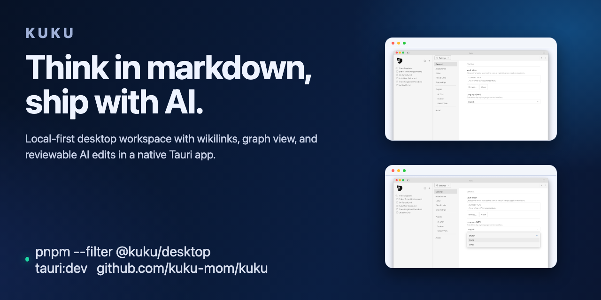
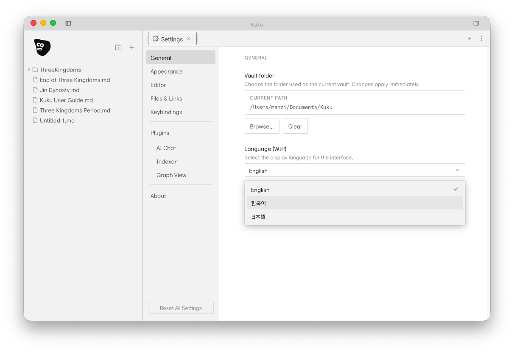
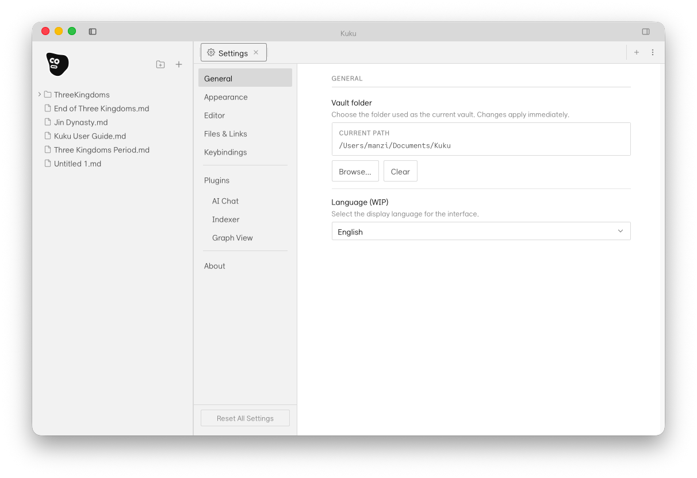
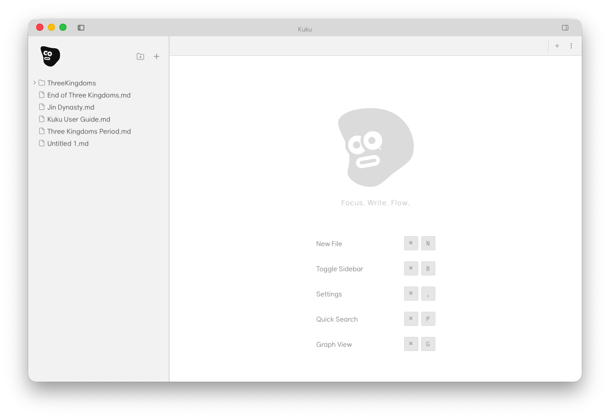

# Kuku

[English](README.md) | 한국어


집중해서 생각하고 쓰기 위한 로컬 우선 마크다운 데스크톱 워크스페이스.

Kuku는 일반 파일 기반 마크다운 편집, 위키링크/백링크, 그래프 탐색, 그리고 승인 기반 AI 파일 수정 워크플로우를 하나의 네이티브 앱으로 제공합니다.



## Screens

<table>
  <tr>
    <th>Workspace Shell</th>
    <th>Provider Setup</th>
  </tr>
  <tr>
    <td></td>
    <td></td>
  </tr>
  <tr>
    <td>볼트 트리, 중앙 에디터, 우측 유틸 레일이 포함된 실제 앱 작업 화면.</td>
    <td>AI 연동을 위한 데스크톱 측 프로바이더/키 설정 흐름.</td>
  </tr>
  <tr>
    <th>Search Surface</th>
    <th>Search With Query</th>
  </tr>
  <tr>
    <td></td>
    <td></td>
  </tr>
  <tr>
    <td>앱 내부 전체 볼트 탐색을 위한 고급 검색 탭.</td>
    <td>쿼리 입력 후 빠른 노트 탐색/이동 상태.</td>
  </tr>
</table>

## 왜 Kuku인가

- 내 파일 기반 로컬 우선 마크다운 워크플로우
- 위키링크, 백링크, 그래프 중심 탐색
- 파일 변경은 승인 기반으로 처리되는 AI 편집
- Tauri 기반 네이티브 데스크톱 런타임 (Electron 아님)

## 빠른 시작

```bash
pnpm install
pnpm --filter @kuku/desktop tauri:dev
```

## 레포지토리 구조

```text
apps/
  desktop/     Tauri 데스크톱 앱 (SolidJS + Rust)
  web/         Astro 웹 (랜딩/인증/대시보드)
  server/      Go API 서버 (Connect RPC)
crates/
  kuku-ai/       AI 연동
  kuku-contract/ RPC 계약 (Rust)
  kuku-indexer/  파일 인덱싱
packages/
  contract/    공유 계약 (gen/go + gen/ts)
infra/docker/
  local/       로컬 스택 (web + server + postgres + mailpit)
  preview/     스테이징
  prod/        프로덕션
```

## 기여

이슈/PR 환영합니다. 큰 변경은 먼저 이슈로 논의해주세요.

## 라이선스

[MIT](LICENSE) © kuku-mom
